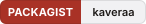

  <picture>
    <source media="(prefers-color-scheme: dark)" srcset="assets/hero-dark.d12cdbd6.svg">
    
  </picture>
  

    <a href="https://augustin-kavera.fr"><picture><source media="(prefers-color-scheme: dark)" srcset="assets/badges/site-dark.e9f3b2af.svg"></picture></a>
    <a href="https://packagist.org/users/kaveraa/"><picture><source media="(prefers-color-scheme: dark)" srcset="assets/badges/packagist-dark.641ec81f.svg"></picture></a>
    <a href="https://www.npmjs.com/~kaveraa"><picture><source media="(prefers-color-scheme: dark)" srcset="assets/badges/npm-dark.4ef37cbd.svg"></picture></a>
    <a href="https://kadelio.com"><picture><source media="(prefers-color-scheme: dark)" srcset="assets/badges/kadelio-dark.9c58816b.svg"></picture></a>
  

I build line-of-business applications for the public sector with **Laravel**, **Symfony**, **Vue 3** and **PostgreSQL**, deployed with Docker, Kubernetes and GitHub Actions. The pieces that keep coming back become small, focused packages, on Packagist and npm: one problem each, Laravel and Symfony/Doctrine support when it makes sense, tests and a short README.

### Shipping log

<!-- shipping-log:start -->
| Released | Package | What shipped |
| :-- | :-- | :-- |
| <code>2026-10-02</code> | [**followtheme**](https://github.com/kaveraa/followtheme) [`v0.1.1`](https://www.npmjs.com/package/@kaveraa/followtheme) | A scoped theme follows the overlays it opens |
| <code>2026-10-01</code> | [**api-gouv-publique-fr**](https://github.com/kaveraa/api-gouv-publique-fr) [`v1.0.0`](https://packagist.org/packages/kaveraa/api-gouv-publique-fr) | Typed client for French public APIs |
| <code>2026-09-30</code> | [**prepare-image**](https://github.com/kaveraa/prepare-image) [`v1.0.3`](https://www.npmjs.com/package/@kaveraa/prepare-image) | Prepare a user-picked photo for upload |
| <code>2026-09-30</code> | [**keycloak-sanctum-vue**](https://github.com/kaveraa/keycloak-sanctum-vue) [`v1.0.3`](https://www.npmjs.com/package/@kaveraa/keycloak-sanctum-vue) | Vue 3 client for laravel-keycloak-sanctum |
| <code>2026-09-29</code> | [**laravel-keycloak-sanctum**](https://github.com/kaveraa/laravel-keycloak-sanctum) [`v1.0.3`](https://packagist.org/packages/kaveraa/laravel-keycloak-sanctum) | Keycloak SSO for a SPA backed by a Laravel API |
<!-- shipping-log:end -->

### Packages

<!-- packages:start -->
<table>
  <tr>
    <td width="50%"><a href="https://github.com/kaveraa/followtheme"><picture><source media="(prefers-color-scheme: dark)" srcset="assets/packages/followtheme-dark.2f341a5d.svg"></picture></a></td>
    <td width="50%"><a href="https://github.com/kaveraa/api-gouv-publique-fr"><picture><source media="(prefers-color-scheme: dark)" srcset="assets/packages/api-gouv-publique-fr-dark.9396e3ff.svg"></picture></a></td>
  </tr>
  <tr>
    <td width="50%"><a href="https://github.com/kaveraa/prepare-image"><picture><source media="(prefers-color-scheme: dark)" srcset="assets/packages/prepare-image-dark.234ae29c.svg"></picture></a></td>
    <td width="50%"><a href="https://github.com/kaveraa/keycloak-sanctum-vue"><picture><source media="(prefers-color-scheme: dark)" srcset="assets/packages/keycloak-sanctum-vue-dark.ad8a7363.svg"></picture></a></td>
  </tr>
  <tr>
    <td width="50%"><a href="https://github.com/kaveraa/laravel-keycloak-sanctum"><picture><source media="(prefers-color-scheme: dark)" srcset="assets/packages/laravel-keycloak-sanctum-dark.2c359276.svg"></picture></a></td>
    <td width="50%"><a href="https://github.com/kaveraa/unaccent-search"><picture><source media="(prefers-color-scheme: dark)" srcset="assets/packages/unaccent-search-dark.63e04dc2.svg"></picture></a></td>
  </tr>
  <tr>
    <td width="50%"><a href="https://github.com/kaveraa/slug-history"><picture><source media="(prefers-color-scheme: dark)" srcset="assets/packages/slug-history-dark.046c7328.svg"></picture></a></td>
    <td width="50%"><a href="https://github.com/kaveraa/data-lifecycle"><picture><source media="(prefers-color-scheme: dark)" srcset="assets/packages/data-lifecycle-dark.28c34d81.svg"></picture></a></td>
  </tr>
</table>
<!-- packages:end -->

### Kadelio

**[Kadelio](https://kadelio.com)** is a SaaS to build a gift list from any online store and share it in one click, used by hundreds of people for births, weddings and birthdays. I design, build and run it end to end: React 19 and Tailwind front-end, Node.js API with Prisma and PostgreSQL, Stripe billing, transactional emails with Resend, error tracking with Sentry, a browser extension and Docker deployment. The code is private, the product is live.

### Stack

<picture>
  <source media="(prefers-color-scheme: dark)" srcset="assets/stack-dark.c6f93c72.svg">
  
</picture>

### Activity

<picture>
  <source media="(prefers-color-scheme: dark)" srcset="assets/activity-dark.b0e695ec.svg">
  
</picture>

### How I work

- **One problem per package.** If a class keeps getting copied between projects, it becomes a package with tests (Pest, Vitest) and a README you can read in two minutes.
- **Framework-agnostic when it matters.** Laravel and Symfony share the same core; the bridge is thin and optional.
- **Boring infrastructure on purpose.** PostgreSQL, Redis, Docker, Kubernetes, GitHub Actions. Keycloak for SSO when the client already has it.
- **Front-end that stays close to the data.** Vue 3 with Pinia on the day job, React 19 on Kadelio, TypeScript on both.

### Elsewhere

- **Website:** [augustin-kavera.fr](https://augustin-kavera.fr), Laravel, Filament and Reverb on the back-end, Vue 3 and Pinia on the front, self-hosted with Docker, nginx and PostgreSQL
- **Packagist:** [kaveraa](https://packagist.org/users/kaveraa/)
- **npm:** [@kaveraa](https://www.npmjs.com/~kaveraa)

<!-- built:start -->
Assets regenerated 2026-10-08 by <a href="https://github.com/kaveraa/kaveraa/actions">a scheduled workflow</a>. No third-party stat cards, everything on this page is rendered from <a href="https://github.com/kaveraa/kaveraa/tree/main/scripts">scripts/</a>.
<!-- built:end -->

